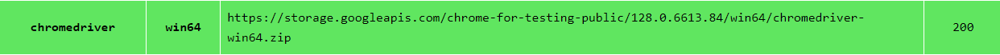

# Shopee Scraping Project

This project is designed to scrape data from Shopee. It includes scripts written in Python to extract and process data from Shopee's website.

## Getting Started

Follow these instructions to set up the project on your local machine.

### Prerequisites

- Python 3.x
- Git

### Chromedriver

Download https://googlechromelabs.github.io/chrome-for-testing/



### Installation

1. **Clone the repository**

   Clone the repository to your local machine using the following command:

   ```bash
   git clone https://github.com/KritsanaMike/scraping_shopee.git

   cd scraping_shopee

   python3 -m venv venv

   venv\Scripts\activate

   source venv/bin/activate

   pip install -r requirements.txt

   python read_tag.py
   ```